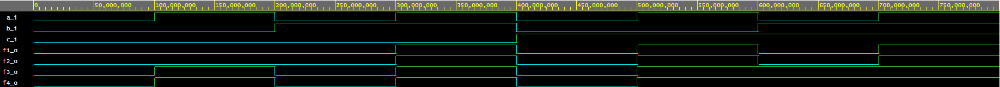

# 01-gates

## My Github
https://github.com/golian-igor/Digital-electronics-1.git/

### 1)De Morgan's laws

#### VHDL Source code:
```vhdl
architecture dataflow of gates is
begin
f_o     <= (not b_i and a_i) or (not c_i and not b_i);
f_nand_o <= not (not (not b_i and a_i) and not(not b_i and not c_i)); 
f_nor_o    <= not (b_i or not a_i) or not (c_i or b_i);
end architecture dataflow;
```

#### Screenshot waveforms:


#### EDA playground link:
https://www.edaplayground.com/x/nYzc

#### Table:
| **c** | **b** |**a** | **f(c,b,a)** |
| :-: | :-: | :-: | :-: |
| 0 | 0 | 0 | 1 |
| 0 | 0 | 1 | 1 |
| 0 | 1 | 0 | 0 |
| 0 | 1 | 1 | 0 |
| 1 | 0 | 0 | 0 |
| 1 | 0 | 1 | 1 |
| 1 | 1 | 0 | 0 |
| 1 | 1 | 1 | 0 |


### 2)Distributive laws

#### VHDL Source code:
```vhdl
architecture dataflow of gates is
begin
f1_o <= (a_i and b_i)or(a_i and c_i);
f2_o <=  a_i and (b_i or c_i);
f3_o <= (a_i or b_i) and (a_i or c_i);
f4_o <=  a_i or (b_i and c_i);
end architecture dataflow;
```

#### Screenshot waveforms:


#### EDA playground link:
https://www.edaplayground.com/x/JGnt
