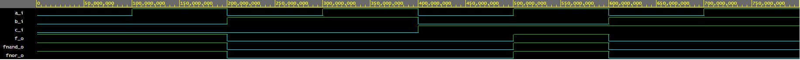

# 01-gates

## My Github
[EDA](https://github.com/golian-igor/Digital-electronics-1/)

### 1)De Morgan's laws

#### Source code:
```vhdl
f_o     <= (not b_i and a_i) or (not c_i and not b_i);
f_nand_o <= not (not (not b_i and a_i) and not(not b_i and not c_i)); 
f_nor_o    <= not (b_i or not a_i) or not (c_i or b_i);
```

#### Screenshot waveforms


#### EDA playground link:
[EDA](https://www.edaplayground.com/x/nYzc/)

#### Table:
| **c** | **b** |**a** | **f(c,b,a)** |
| :-: | :-: | :-: | :-: |
| 0 | 0 | 0 | 1 |
| 0 | 0 | 1 | 1 |
| 0 | 1 | 0 | 0 |
| 0 | 1 | 1 | 0 |
| 1 | 0 | 0 | 0 |
| 1 | 0 | 1 | 1 |
| 1 | 1 | 0 | 0 |
| 1 | 1 | 1 | 0 |


### 2)Distributive laws
