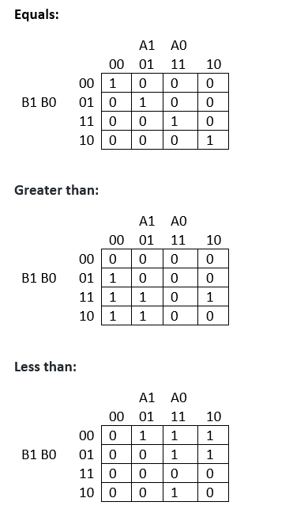
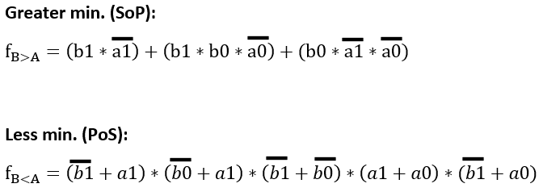

# 02-logic

### 1)Truth bable

| **Dec. equivalent** | **B[1:0]** | **A[1:0]** | **B is greater than A** | **B equals A** | **B is less than A** |
| :-: | :-: | :-: | :-: | :-: | :-: |
| 0  | 0 0 | 0 0 | 0 | 1 | 0 |
| 1  | 0 0 | 0 1 | 0 | 0 | 1 |
| 2  | 0 0 | 1 0 | 0 | 0 | 1 |
| 3  | 0 0 | 1 1 | 0 | 0 | 1 |
| 4  | 0 1 | 0 0 | 1 | 0 | 0 |
| 5  | 0 1 | 0 1 | 0 | 1 | 0 |
| 6  | 0 1 | 1 0 | 0 | 0 | 1 |
| 7  | 0 1 | 1 1 | 0 | 0 | 1 |
| 8  | 1 0 | 0 0 | 1 | 0 | 0 |
| 9  | 1 0 | 0 1 | 1 | 0 | 0 |
| 10 | 1 0 | 1 0 | 0 | 1 | 0 |
| 11 | 1 0 | 1 1 | 0 | 0 | 1 |
| 12 | 1 1 | 0 0 | 1 | 0 | 0 |
| 13 | 1 1 | 0 1 | 1 | 0 | 0 |
| 14 | 1 1 | 1 0 | 1 | 0 | 0 |
| 15 | 1 1 | 1 1 | 0 | 1 | 0 |

### 2) 2-Bit comparator

#### Karnaugh maps:

#### Equations SoP and PoS:

#### EDA playground link:
https://www.edaplayground.com/x/nu76

### 3) 4-bit comparator

#### VHDL architecture from design file:
------------------------------------------------------------------------
-- Entity declaration for 2-bit binary comparator
------------------------------------------------------------------------
entity comparator_2bit is
    port(
        a_i           : in  std_logic_vector(4 - 1 downto 0);
        b_i           : in  std_logic_vector(4 - 1 downto 0);

        -- COMPLETE THE ENTITY DECLARATION

	B_greater_A_o : out std_logic;       -- B is greater than A
        B_equals_A_o  : out std_logic;       -- B equals A
        B_less_A_o    : out std_logic        -- B is less than A
                  
    );
end entity comparator_2bit;

------------------------------------------------------------------------
-- Architecture body for 2-bit binary comparator
------------------------------------------------------------------------
architecture Behavioral of comparator_2bit is
begin
	B_greater_A_o   <= '1' when (b_i > a_i) else '0';
	B_equals_A_o    <= '1' when (b_i = a_i) else '0';
    	B_less_A_o      <= '1' when (b_i < a_i) else '0';

    -- WRITE "GREATER" AND "EQUALS" ASSIGNMENTS HERE

end architecture Behavioral;

#### VHDL stimulus process from testbench file:

#### Console with one reported error:

#### EDA playground link: