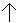

# 07-ffs
### 1)Preparation tasks

#### Characteristic equations:


#### Completed tables for D, JK, T flip-flops:

| **clk** | **d** | **q(n)** | **q(n+1)** | **Comments** |
| :-: | :-: | :-: | :-: | :-- |
|  | 0 | 0 | 0 | No change |
|  | 0 | 1 | 0 | Change    |
|  | 1 | 0 | 1 | Change    | 
|  | 1 | 1 | 1 | No Change |

| **clk** | **j** | **k** | **q(n)** | **q(n+1)** | **Comments** |
| :-: | :-: | :-: | :-: | :-: | :-- |
|  | 0 | 0 | 0 | 0 | No change |
|  | 0 | 0 | 1 | 1 | No change |
|  | 0 | 1 | 0 | 0 | Reset     |
|  | 0 | 1 | 1 | 0 | Reset     |
|  | 1 | 0 | 0 | 1 | Set       |
|  | 1 | 0 | 1 | 1 | Set       |
|  | 1 | 1 | 0 | 1 | Toggle    |
|  | 1 | 1 | 1 | 0 | Toggle    |

| **clk** | **t** | **q(n)** | **q(n+1)** | **Comments** |
| :-: | :-: | :-: | :-: | :-- |
|  | 0 | 0 | 0 | No change |
|  | 0 | 1 | 1 | No change |
|  | 1 | 0 | 1 | Toggle    |
|  | 1 | 1 | 0 | Toggle    |

### 2)D latch

#### Listing of VHDL code of the process:
```vhdl
p_d_latch : process (d, arst, en)
    begin
        if (arst = '1') then
            q     <= '0';
            q_bar <= '1';
        elsif (en = '1') then
            q     <= d;
            q_bar <= not d;
        end if;
    end process p_d_latch;
```

#### Listing of VHDL reset and stimulus processes from the testbench
##### Reset:
```vhdl
p_reset_gen : process
    begin
        s_arst <= '0';
        wait for 53 ns;
        
        -- Reset activated
        s_arst <= '1';
        wait for 5 ns;

        -- Reset deactivated
        s_arst <= '0';
        
        wait for 108 ns;
        s_arst <= '1';
        
        wait;
    end process p_reset_gen;
```

##### Stimulus processes:
```vhdl
p_stimulus : process
    begin
        report "Stimulus process started" severity note;
        s_en <= '0';
        s_d  <= '0';
        
        --d sequence
        wait for 10 ns;
        s_d  <= '1';
        wait for 10 ns;
        s_d  <= '0';
        wait for 10 ns;
        s_d  <= '1';
        wait for 10 ns;
        s_d  <= '0';
        wait for 10 ns;
        s_d  <= '1';
        wait for 10 ns;
        s_d  <= '0';
        wait for 10 ns;
        --/d sequence
        
        s_en <= '1';
        wait for 5 ns;
        assert(s_q = '1' and s_q_bar = '0')
        report "s_q=1,s_q_bar=0" severity error;
        
        --d sequence
        wait for 10 ns;
        s_d  <= '1';
        wait for 10 ns;
        s_d  <= '0';
        wait for 10 ns;
        s_d  <= '1';
        wait for 10 ns;
        s_d  <= '0';
        wait for 10 ns;
        s_d  <= '1';
        wait for 10 ns;
        s_en <= '0';
        wait for 10 ns;
        s_d  <= '0';
        wait for 10 ns;
        --/d sequence
        
        s_en <= '0';     
        wait for 5 ns;
        assert(s_q = '0' and s_q_bar = '1')
        report "s_q=0,s_q_bar=1" severity error;
        
        --d sequence
        wait for 10 ns;
        s_d  <= '1';
        wait for 10 ns;
        s_d  <= '0';
        wait for 10 ns;
        s_d  <= '1';
        wait for 10 ns;
        s_d  <= '0';
        wait for 10 ns;
        s_d  <= '1';
        wait for 10 ns;
        s_d  <= '0';
        wait for 10 ns;
        --/d sequence
        
        s_en <= '1';
        wait for 5 ns;
        assert(s_q = '1' and s_q_bar = '0')
        report "s_q=1,s_q_bar=0" severity error;
        
        --d sequence
        wait for 10 ns;
        s_d  <= '1';
        wait for 10 ns;
        s_d  <= '0';
        wait for 10 ns;
        s_d  <= '1';
        wait for 10 ns;
        s_d  <= '0';
        wait for 10 ns;
        s_d  <= '1';
        wait for 10 ns;
        s_d  <= '0';
        wait for 10 ns;
        --/d sequence
        
        
        report "Stimulus process finished" severity note;
        wait;
    end process p_stimulus;
```

#### Screenshot waveforms:


### 3)Flip-flops

#### p_d_ff_arst
##### Listing of VHDL code of the process:
```vhdl
p_d_ff_arst : process (clk, arst)
    begin
        if (arst = '1') then
            q     <= '0';
            q_bar <= '1';
            
        elsif rising_edge (clk) then
            q     <= d;
            q_bar <= not d;
            
        end if;
    end process p_d_ff_arst;
```

##### Listing of VHDL clock, reset and stimulus processes from the testbench:
```vhdl
    --------------------------------------------------------------------
    -- Clock generation process
    --------------------------------------------------------------------
    p_clk_gen : process
    begin
        while now < 750 ns loop         
            s_clk_100MHz <= '0';
            wait for c_CLK_100MHZ_PERIOD / 2;
            s_clk_100MHz <= '1';
            wait for c_CLK_100MHZ_PERIOD / 2;
        end loop;
        wait;
    end process p_clk_gen;

    --------------------------------------------------------------------
    -- Reset generation process
    --------------------------------------------------------------------
    --- WRITE YOUR CODE HERE
    p_reset_gen : process
    begin
        s_arst <= '0';
        wait for 58 ns;
        
        -- Reset activated
        s_arst <= '1';
        wait for 15 ns;

        -- Reset deactivated
        s_arst <= '0';
        
        wait;
    end process p_reset_gen;
    
    p_stimulus : process
    begin
        report "Stimulus process started" severity note;
 
        s_d  <= '1';
        wait for 10 ns;
        assert(s_q = '0' and s_q_bar = '1')
        report "Error" severity note;
        
        s_d  <= '0';
        wait for 10 ns;
        assert(s_q = '0' and s_q_bar = '1')
        report "Error" severity note;
        
        s_d  <= '1';
        wait for 10 ns;
        assert(s_q = '1' and s_q_bar = '0')
        report "Error" severity note;
        
        s_d  <= '0';
        wait for 10 ns;
        assert(s_q = '0' and s_q_bar = '1')
        report "Error" severity note;
        
        s_d  <= '1';
        wait for 10 ns;
        assert(s_q = '0' and s_q_bar = '1')
        report "Error" severity note;
        
        
        report "Stimulus process finished" severity note;
        wait;
    end process p_stimulus;
```

##### Screenshot waveforms:


#### p_d_ff_rst
##### Listing of VHDL code of the process:
```vhdl
p_d_ff_rst : process (clk)
    begin
    if rising_edge (clk) then
        if (rst = '1') then
            q     <= '0';
            q_bar <= '1';           
        else
            q     <= d;
            q_bar <= not d;
         end if;   
        end if;
    end process p_d_ff_rst;
```

##### Listing of VHDL clock, reset and stimulus processes from the testbench:
```vhdl
    --------------------------------------------------------------------
    -- Clock generation process
    --------------------------------------------------------------------
    p_clk_gen : process
    begin
        while now < 750 ns loop         
            s_clk_100MHz <= '0';
            wait for c_CLK_100MHZ_PERIOD / 2;
            s_clk_100MHz <= '1';
            wait for c_CLK_100MHZ_PERIOD / 2;
        end loop;
        wait;
    end process p_clk_gen;
    
    --------------------------------------------------------------------
    -- Reset generation process
    --------------------------------------------------------------------
    --- WRITE YOUR CODE HERE
    p_reset_gen : process
    begin
        s_rst <= '0';
        wait for 58 ns;
        
        -- Reset activated
        s_rst <= '1';
        wait for 15 ns;

        -- Reset deactivated
        s_rst <= '0';
        
        wait;
    end process p_reset_gen;
    
    p_stimulus : process
    begin
        report "Stimulus process started" severity note;
 
        s_d  <= '1';
        wait for 10 ns;
        assert(s_q = '1' and s_q_bar = '0')
        report "Error" severity note;
        
        s_d  <= '0';
        wait for 10 ns;
        assert(s_q = '0' and s_q_bar = '1')
        report "Error" severity note;
        
        s_d  <= '1';
        wait for 10 ns;
        assert(s_q = '0' and s_q_bar = '1')
        report "Error" severity note;
        
        s_d  <= '0';
        wait for 10 ns;
        assert(s_q = '0' and s_q_bar = '1')
        report "Error" severity note;
        
        s_d  <= '1';
        wait for 10 ns;
        assert(s_q = '1' and s_q_bar = '0')
        report "Error" severity note;
        
        
        report "Stimulus process finished" severity note;
        wait;
    end process p_stimulus;
```

##### Screenshot waveforms:


#### p_jk_ff_rst
##### Listing of VHDL code of the process:
```vhdl
p_jk_ff_rst : process (clk)
    begin          
        if rising_edge (clk) then
            if (rst = '1') then
                s_q <= '0';
            else
            if (j = '0' and k = '0') then
                s_q <= s_q;
            elsif (j = '0' and k = '1') then
                s_q <= '0';
            elsif (j = '1' and k = '0') then
                s_q <= '1';
            elsif (j = '1' and k = '1') then
                s_q <= not s_q;
           
            end if;
          end if;    
       end if;
    end process p_jk_ff_rst;
```

##### Listing of VHDL clock, reset and stimulus processes from the testbench:
```vhdl
--------------------------------------------------------------------
    -- Clock generation process
    --------------------------------------------------------------------
    p_clk_gen : process
    begin
        while now < 750 ns loop         -- 75 periods of 100MHz clock
            s_clk_100MHz <= '0';
            wait for c_CLK_100MHZ_PERIOD / 2;
            s_clk_100MHz <= '1';
            wait for c_CLK_100MHZ_PERIOD / 2;
        end loop;
        wait;
    end process p_clk_gen;
    
    --- WRITE YOUR CODE HERE
    p_reset_gen : process
    begin
        s_rst <= '0';
        wait for 58 ns;
        
        -- Reset activated
        s_rst <= '1';
        wait for 15 ns;

        -- Reset deactivated
        s_rst <= '0';
        
        wait;
    end process p_reset_gen;
    
    p_stimulus : process
    begin
        report "Stimulus process started" severity note;
 
        s_j  <= '0';
        s_k  <= '0';
        wait for 10 ns;
        assert(s_q = '1' and s_q_bar = '0')
        report "Error" severity note;
        
        s_j  <= '0';
        s_k  <= '1';
        wait for 10 ns;
        assert(s_q = '0' and s_q_bar = '1')
        report "Error" severity note;
        
        s_j  <= '1';
        s_k  <= '0';
        wait for 10 ns;
        assert(s_q = '1' and s_q_bar = '0')
        report "Error" severity note;
        
        s_j  <= '1';
        s_k  <= '1';
        wait for 10 ns;
        assert(s_q = '1' and s_q_bar = '0')
        report "Error" severity note;
         
 
        s_j  <= '1';
        s_k  <= '1';
        wait for 10 ns;
        assert(s_q = '0' and s_q_bar = '1')
        report "Error" severity note;
        
        s_j  <= '1';
        s_k  <= '1';
        wait for 10 ns;    
        assert(s_q = '1' and s_q_bar = '0')
        report "Error" severity note;
             
        
        report "Stimulus process finished" severity note;
        wait;
    end process p_stimulus
```

##### Screenshot waveforms:


#### p_t_ff_rst
##### Listing of VHDL code of the process:
```vhdl
p_t_ff_rst : process (clk)
    begin          
        if rising_edge (clk) then
            if (rst = '1') then
                s_q     <= '0';
                s_q_bar <= '1';
            else
            if (t = '0') then
                s_q     <= s_q;
                s_q_bar <= s_q_bar;
            else
                s_q     <= not s_q;
                s_q_bar <= not s_q_bar;       
            end if;
          end if;    
       end if;
    end process p_t_ff_rst;
```

##### Listing of VHDL clock, reset and stimulus processes from the testbench:
```vhdl
--------------------------------------------------------------------
    -- Clock generation process
    --------------------------------------------------------------------
    p_clk_gen : process
    begin
        while now < 750 ns loop         -- 75 periods of 100MHz clock
            s_clk_100MHz <= '0';
            wait for c_CLK_100MHZ_PERIOD / 2;
            s_clk_100MHz <= '1';
            wait for c_CLK_100MHZ_PERIOD / 2;
        end loop;
        wait;
    end process p_clk_gen;
    
    --- WRITE YOUR CODE HERE
    p_reset_gen : process
    begin
        s_rst <= '0';
        wait for 58 ns;
        
        -- Reset activated
        s_rst <= '1';
        wait for 15 ns;

        -- Reset deactivated
        s_rst <= '0';
        
        wait;
    end process p_reset_gen;
    
    p_stimulus : process
    begin
        report "Stimulus process started" severity note;
        
        s_t  <= '1';
        wait for 10 ns;
        assert(s_q = '1' and s_q_bar = '0')
        report "Error" severity note;
        
        s_t  <= '0';
        wait for 10 ns;
        assert(s_q = '1' and s_q_bar = '0')
        report "Error" severity note;
        
        s_t  <= '1';
        wait for 10 ns;
        assert(s_q = '0' and s_q_bar = '1')
        report "Error" severity note;
        
        s_t  <= '0';
        wait for 10 ns;
        assert(s_q = '0' and s_q_bar = '1')
        report "Error" severity note;
         
        s_t  <= '1';
        wait for 10 ns;
        assert(s_q = '1' and s_q_bar = '0')
        report "Error" severity note;
        
        s_t  <= '0';
        wait for 10 ns;    
        assert(s_q = '1' and s_q_bar = '0')
        report "Error" severity note;
             
        
        report "Stimulus process finished" severity note;
        wait;
    end process p_stimulus;
```

##### Screenshot waveforms:


### 4)Shift register

#### Image of the shift register schematic:


