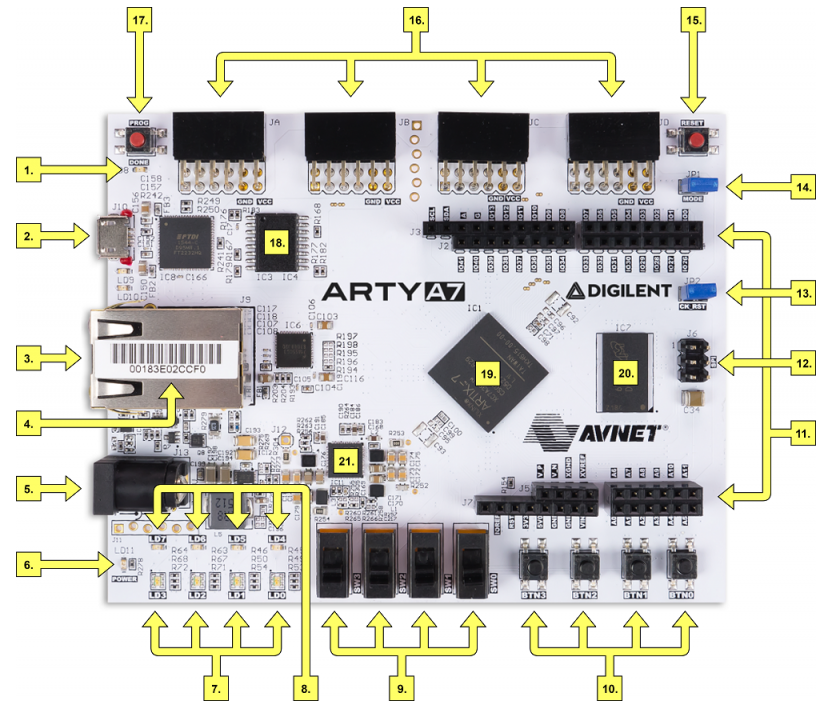
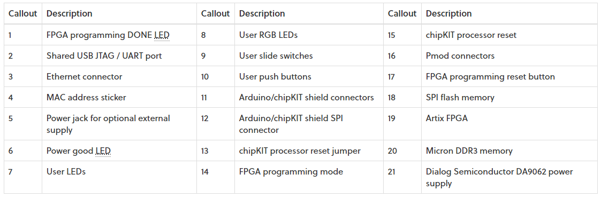
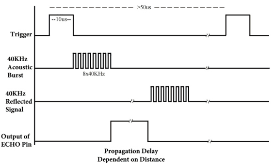

# Projekt - Parkovací asistent

## Členové týmu:
| **Jméno(ID)** | **GitHub** |
| :-: | :-: |
| Gmitter jakub (220814)  | [Link](https://github.com/xgmitt00/Digital-electronics-1/tree/main/Labs) |
| Golian Igor (223288)    | [Link](https://github.com/golian-igor/Digital-electronics-1/tree/main/Labs/projekt) |
| Grenčík Dominik (220815)| [Link](https://github.com/DomikGrencik/Digital-electronics-1/tree/main/Labs) |
| Hála David (220889)     | [Link](https://github.com/DavidHala123/Digital-electronics-1/tree/main/Labs) |

## Zadání projektu:
Parkovací asistent s ultrazvukovým senzorem HC-SR04, zvuková signalizace pomocí PWM, signalizace pomocí LED bargrafu

## Cíl projektu:
Cílem projektu je vytvořit program  parkovací asistent, který bude napsaný v jazyce VHDL na desce A7-100T. Nejdůležitější částí programu tvoří ultrazvukový senzor HC-SR04, který zajišťuje vzdálenost od jednotlivých překážek. Senzor je doplněn LED diodami, které se budou rozsvicovat podle dané vzdálenosti od překážek. Program také obsahuje zvukovou signalizaci pomocí bzučáku, který má za úkol upozornit na blížící se předmět. 

## Popis Hardwaru:
### Deska A7-100T
Deska je kompletní platforma pro vývoj digitálních obvodů. Založená na nejnovějším poli FPGA od společnosti Artix-7 ™. Díky velkému vysokokapacitnímu FPGA, velkorysým externím pamětím, kolekci USB, Ethernetu a dalších portů může Nexys A7 hostit designy od úvodních kombinačních obvodů až po výkonné vestavěné procesory.

#### Popis Desky:

  
### Senzor HC-SR04
Ultrazvukový senzor, který slouží především jako detektor překážek. Měřící vzdálenost je v rozsahu od 2cm do 4m. Obsahuje 4 pinový konektor se standartní roztečí 2,54mm. Piny: VCC, GND, TRIG, ECHO. Princip funkce senzoru: Nejprve vyšle 10us puls na pin Trigger, který následovně vyšle 8 zvukových impulzů o frekvecni 40kHz. Poté co se vyslaný signál odrazí od překážky, vrátí se zpět na pin Echo. Pokud se překážka nachází nad 4m a signál se nevrátí do 38ms, pin echo se nastaví automaticky na Low.

#### Princip:

### Bzučák
Pro zvukovou signalizaci pomocí PWM jsme zvolili jednoduchý piezo bzučák s napájecím napětím 3V - 5V.

### LED bargraf
Pro signalizaci jsme zvolili 8 segmentový LED bargraf. 

## Popis a simulace modulů VHDL:

## Video:

## Použité zdroje:
1) Deska - [A7-100T](https://reference.digilentinc.com/reference/programmable-logic/arty-a7/reference-manual)
2) Ultrazvukový senzor - [HC-SR04](https://cdn.sparkfun.com/datasheets/Sensors/Proximity/HCSR04.pdf)

